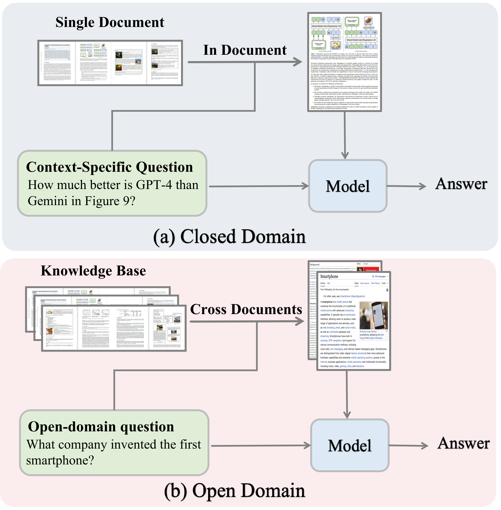
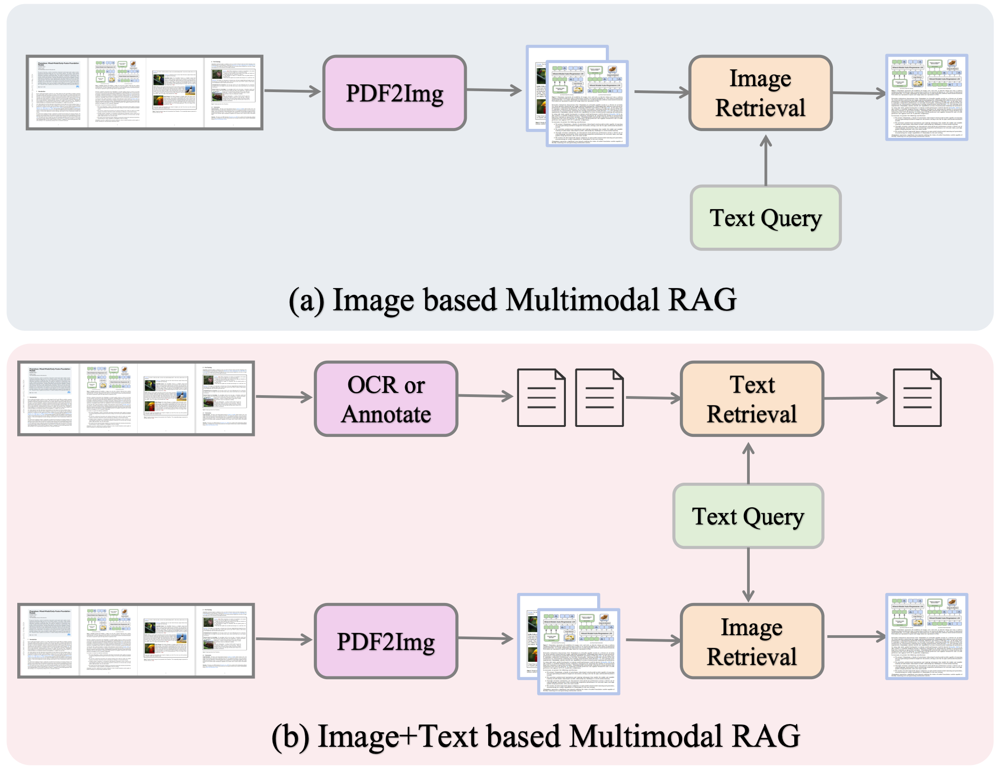
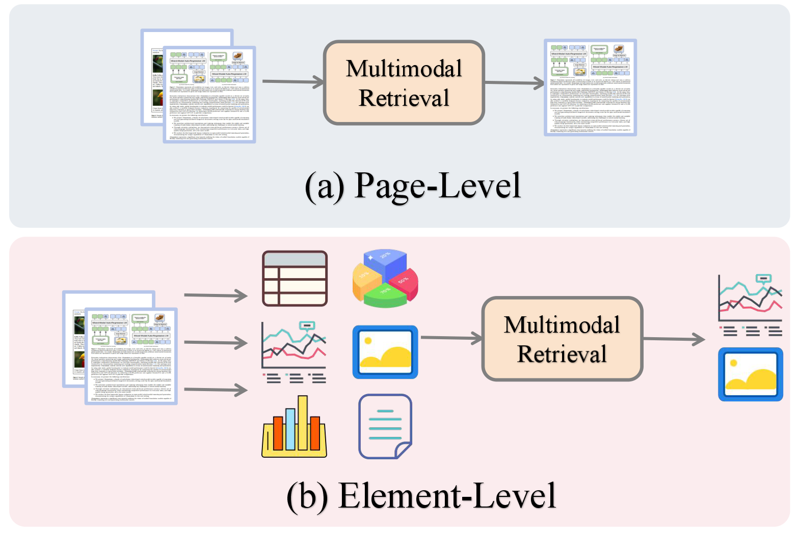
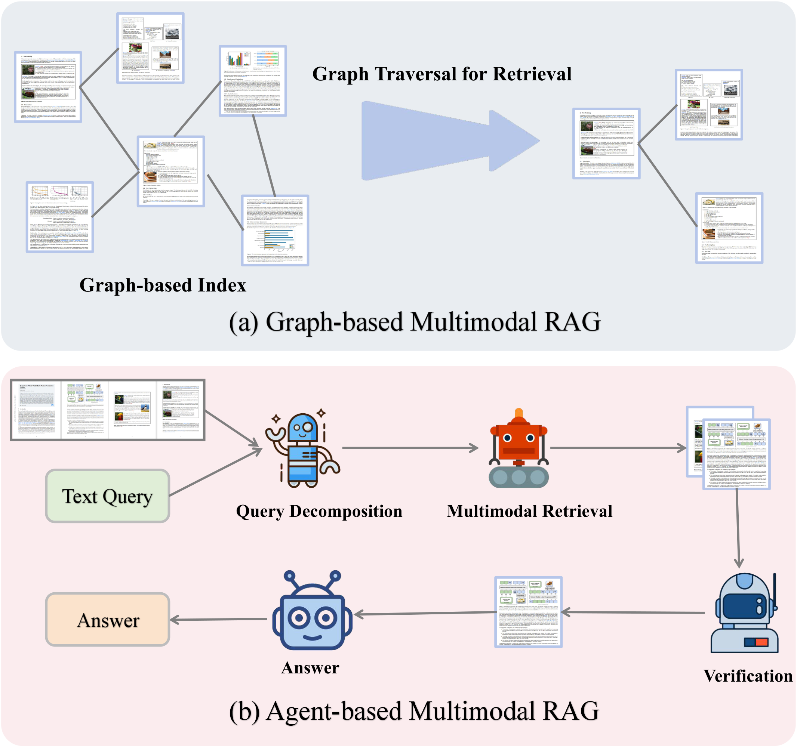

# Scaling Beyond Context: A Survey of Multimodal Retrieval-Augmented Generation for Document Understanding

<p align="center">
  <b>ACL 2026 Main Conference</b>
</p>

<p align="center">
  <a href="https://arxiv.org/abs/2510.15253"></a>
  <a href="https://sensengao.github.io/Multimodal-RAG-Survey/"></a>
  <a href="https://github.com/SensenGao/Multimodal-RAG-Survey-For-Document"></a>
</p>

<p align="center">
  <a href="https://sensengao.github.io/">Sensen Gao</a><sup>1*</sup>,
  Shanshan Zhao<sup>2&dagger;</sup>,
  Xu Jiang<sup>3</sup>,
  Lunhao Duan<sup>4*</sup>,
  Yong Xien Chng<sup>3*</sup>,
  <br>
  Qing-Guo Chen<sup>2</sup>,
  Weihua Luo<sup>2</sup>,
  Kaifu Zhang<sup>2</sup>,
  <a href="https://jwbian.net/">Jia-Wang Bian</a><sup>1</sup>,
  <a href="https://mingming-gong.github.io/">Mingming Gong</a><sup>1,5&dagger;</sup>
</p>

<p align="center">
  <sup>1</sup>MBZUAI &nbsp;
  <sup>2</sup>Alibaba International Digital Commerce Group &nbsp;
  <sup>3</sup>Tsinghua University &nbsp;
  <sup>4</sup>Wuhan University &nbsp;
  <sup>5</sup>University of Melbourne
</p>

<p align="center">
  <sub>* Work done during an internship at Alibaba International Digital Commerce Group. &dagger; Corresponding authors.</sub>
</p>

---

<p align="center">
  
</p>

This repository maintains a curated list of **methods**, **datasets**, and **benchmarks** for Multimodal Retrieval-Augmented Generation (RAG) in Document Understanding, based on our ACL 2026 survey. We will keep updating this list. Feel free to open an issue or PR if we missed any relevant work!

## Updates

- **2026.04** - Paper accepted at **ACL 2026 Main Conference**!
- **2025.10** - Paper available on [arXiv](https://arxiv.org/abs/2510.15253).

## Table of Contents

- [Overview](#overview)
- [Methods](#methods)
  - [Open-Domain Methods](#open-domain-methods)
  - [Closed-Domain Methods](#closed-domain-methods)
  - [Graph-based Methods](#graph-based-methods)
  - [Agent-based Methods](#agent-based-methods)
- [Datasets & Benchmarks](#datasets--benchmarks)
  - [Document Understanding Datasets](#document-understanding-datasets)
  - [Multimodal RAG Benchmarks](#multimodal-rag-benchmarks)
- [Citation](#citation)

## Overview

<p align="center">
  
</p>
<p align="center"><b>Open-domain vs. closed-domain multimodal RAG.</b></p>

<p align="center">
  
</p>
<p align="center"><b>Retrieval modality: image-based vs. image+text-based.</b></p>

<p align="center">
  
</p>
<p align="center"><b>Retrieval granularity: page-level vs. element-level.</b></p>

<p align="center">
  
</p>
<p align="center"><b>Hybrid enhancements: graph-based and agent-based multimodal RAG.</b></p>

## Methods

### Open-Domain Methods

| Method | Venue | Modality | Granularity | Training | Paper |
|--------|-------|----------|-------------|----------|-------|
| DSE | EMNLP 2024 | Image | Page | Yes | [Link](https://arxiv.org/abs/2406.11251) |
| ColPali | ICLR 2025 | Image | Page | Yes | [Link](https://arxiv.org/abs/2407.01449) |
| ColQwen2 | ICLR 2025 | Image | Page | Yes | [Link](https://arxiv.org/abs/2407.01449) |
| VisRAG | ICLR 2025 | Image | Page | Yes | [Link](https://arxiv.org/abs/2410.10594) |
| M3DocRAG | Preprint | Image | Page | No | [Link](https://arxiv.org/abs/2411.04952) |
| VisDoMRAG | NAACL 2025 | Image+Text | Page | No | [Link](https://arxiv.org/abs/2412.03628) |
| GME | CVPR 2025 | Image+Text | Page | Yes | [Link](https://arxiv.org/abs/2502.09153) |
| ViDoRAG | EMNLP 2025 | Image+Text | Page | No | [Link](https://arxiv.org/abs/2502.11854) |
| HM-RAG | ACM MM 2025 | Image+Text | Page | No | [Link](https://arxiv.org/abs/2504.00330) |
| VDocRAG | CVPR 2025 | Image | Page | Yes | [Link](https://arxiv.org/abs/2504.01016) |
| VRAG-RL | Preprint | Image | Element | Yes | [Link](https://arxiv.org/abs/2505.14827) |
| CoRe-MMRAG | ACL 2025 | Image+Text | Page | Yes | [Link](https://arxiv.org/abs/2502.06989) |
| Light-ColPali | ACL 2025 | Image | Page | Yes | [Link](https://arxiv.org/abs/2502.14902) |
| MM-R5 | Preprint | Image | Page | Yes | [Link](https://arxiv.org/abs/2503.19587) |
| SimpleDoc | Preprint | Image+Text | Page | No | [Link](https://arxiv.org/abs/2502.09872) |
| DocVQA-RAP | ICIC 2025 | Image | Element | No | [Link](https://arxiv.org/abs/2501.02297) |
| RL-QR | Preprint | Image | Page | Yes | [Link](https://arxiv.org/abs/2505.13508) |
| Patho-AgenticRAG | Preprint | Image | Page | Yes | [Link](https://arxiv.org/abs/2504.07485) |
| M2IO-R1 | Preprint | Image+Text | Page | Yes | [Link](https://arxiv.org/abs/2504.14964) |
| mKG-RAG | Preprint | Image+Text | Element | Yes | [Link](https://arxiv.org/abs/2505.15541) |
| DB3Team-RAG | Preprint | Image+Text | Page | Yes | [Link](https://arxiv.org/abs/2509.09681) |
| PREMIR | EMNLP 2025 | Image+Text | Element | No | [Link](https://arxiv.org/abs/2502.16940) |
| CMRAG | Preprint | Image+Text | Page | No | [Link](https://arxiv.org/abs/2505.22658) |
| MoLoRAG | EMNLP 2025 | Image | Page | Yes | [Link](https://arxiv.org/abs/2504.07464) |
| SERVAL | Preprint | Image | Page | No | [Link](https://arxiv.org/abs/2504.07806) |
| MetaEmbed | Preprint | Image | Page | Yes | [Link](https://arxiv.org/abs/2505.11514) |
| DocPruner | Preprint | Image | Page | Yes | [Link](https://arxiv.org/abs/2505.11846) |
| RECON | Preprint | Image+Text | Element | No | [Link](https://arxiv.org/abs/2505.22143) |
| LAD-RAG | Preprint | Image+Text | Element | No | [Link](https://arxiv.org/abs/2504.13079) |
| HEAVEN | Preprint | Image | Page | No | [Link](https://arxiv.org/abs/2505.09589) |
| MARA | ACM MM 2025 | Image | Element | Yes | [Link](https://arxiv.org/abs/2504.08890) |
| HPC-ColPali | Preprint | Image | Page | Yes | [Link](https://arxiv.org/abs/2502.18990) |
| RegionRAG | Preprint | Image | Element | Yes | [Link](https://arxiv.org/abs/2505.23373) |
| IndustryRAG | EMNLP Industry 2025 | Image | Page | No | [Link](https://arxiv.org/abs/2505.18866) |
| COLMATE | EMNLP Industry 2025 | Image | Page | Yes | [Link](https://arxiv.org/abs/2504.18509) |
| LILaC | EMNLP 2025 | Image | Element | No | [Link](https://arxiv.org/abs/2505.22510) |
| HKRAG | Preprint | Image | Element | Yes | [Link](https://arxiv.org/abs/2505.21625) |
| SLEUTH | Preprint | Image | Page | No | [Link](https://arxiv.org/abs/2505.20785) |
| Snappy | Preprint | Image | Element | No | [Link](https://arxiv.org/abs/2505.14089) |

### Closed-Domain Methods

| Method | Venue | Modality | Granularity | Training | Paper |
|--------|-------|----------|-------------|----------|-------|
| CREAM | ACM MM 2024 | Image+Text | Page | Yes | [Link](https://arxiv.org/abs/2411.19772) |
| SV-RAG | ICLR 2025 | Image | Page | Yes | [Link](https://arxiv.org/abs/2411.14110) |
| FRAG | Preprint | Image | Page | No | [Link](https://arxiv.org/abs/2503.09275) |
| MG-RAG | Preprint | Image+Text | Element | No | [Link](https://arxiv.org/abs/2503.16586) |
| VisChunk | Preprint | Image+Text | Page | No | [Link](https://arxiv.org/abs/2505.11028) |
| MMRAG-DocQA | Preprint | Image+Text | Element | No | [Link](https://arxiv.org/abs/2505.20571) |
| ReDocRAG | ICDAR WML 2025 | Image | Page | Yes | [Link](https://arxiv.org/abs/2505.11832) |
| DREAM | ACM MM 2025 | Image | Page | Yes | [Link](https://arxiv.org/abs/2502.20946) |
| HEAR | ACM MMW 2025 | Image+Text | Page | No | [Link](https://arxiv.org/abs/2505.12470) |

### Graph-based Methods

| Method | Venue | Key Idea | Paper |
|--------|-------|----------|-------|
| HM-RAG | ACM MM 2025 | Hierarchical multi-agent framework with graph databases for structured relation capture | [Link](https://arxiv.org/abs/2504.00330) |
| mKG-RAG | Preprint | Multimodal knowledge graphs aligning entities across vision and text | [Link](https://arxiv.org/abs/2505.15541) |
| DB3Team-RAG | Preprint | Image-indexed knowledge graphs for domain-specific retrieval | [Link](https://arxiv.org/abs/2509.09681) |
| MoLoRAG | EMNLP 2025 | Page graphs encoding logical connections via graph traversal | [Link](https://arxiv.org/abs/2504.07464) |
| RECON | Preprint | Global multimodal document graph linking intra-page and inter-page relations | [Link](https://arxiv.org/abs/2505.22143) |
| LAD-RAG | Preprint | Layout-aware component graphs with dynamic traversal | [Link](https://arxiv.org/abs/2504.13079) |
| LILaC | EMNLP 2025 | Layered component graph with late interaction subgraph retrieval | [Link](https://arxiv.org/abs/2505.22510) |

### Agent-based Methods

| Method | Venue | Key Idea | Paper |
|--------|-------|----------|-------|
| ViDoRAG | EMNLP 2025 | Iterative agent workflow with exploration, summarization, and reflection | [Link](https://arxiv.org/abs/2502.11854) |
| HM-RAG | ACM MM 2025 | Hierarchical multi-agent with query decomposition and consistency voting | [Link](https://arxiv.org/abs/2504.00330) |
| Patho-AgenticRAG | Preprint | Task decomposition and multi-turn search for pathology textbooks | [Link](https://arxiv.org/abs/2504.07485) |
| HEAR | ACM MMW 2025 | Closed-loop multi-agent reasoning with VLM-based document parsing | [Link](https://arxiv.org/abs/2505.12470) |
| SLEUTH | Preprint | Coarse-to-fine agent filtering and distilling salient evidence | [Link](https://arxiv.org/abs/2505.20785) |

## Datasets & Benchmarks

### Document Understanding Datasets

| Dataset | #Queries | #Docs/Images | Content | Paper |
|---------|----------|--------------|---------|-------|
| TabFQuAD | 210 | 210 (I) | Table | [Link](https://arxiv.org/abs/2009.09263) |
| PlotQA | 28.9M | 224K (I) | Chart | [Link](https://arxiv.org/abs/1909.00997) |
| DocVQA | 50K | 12,767 (I) | Text, Table, Chart | [Link](https://arxiv.org/abs/2007.00398) |
| VisualMRC | 30,562 | 10,197 (I) | Text, Table, Chart | [Link](https://arxiv.org/abs/2101.11272) |
| TAT-DQA | 16,558 | 2,758 (D) | Text, Table, Chart | [Link](https://arxiv.org/abs/2207.01181) |
| InfoVQA | 30K | 5.4K (I) | Text, Table, Chart | [Link](https://arxiv.org/abs/2104.12756) |
| ChartQA | 23.1K | 17.1K (I) | Chart | [Link](https://arxiv.org/abs/2203.10244) |
| ScienceQA | 21K | 7,803 (I) | Text, Table, Chart | [Link](https://arxiv.org/abs/2209.09513) |
| DUDE | 41,491 | 4,974 (D) | Text, Table, Chart | [Link](https://arxiv.org/abs/2305.08455) |
| SlideVQA | 52K | 14.5K (I) | Slide | [Link](https://arxiv.org/abs/2301.04883) |
| ArXivQA | 100K | 16.6K (D) | Text, Table, Chart | [Link](https://arxiv.org/abs/2403.17100) |
| MMLongBench-Doc | 1,062 | 130 (D) | Text, Table, Chart, Slide | [Link](https://arxiv.org/abs/2407.01523) |
| PaperTab | 393 | 307 (D) | Text, Table | [Link](https://arxiv.org/abs/2404.12457) |
| FetaTab | 1,023 | 878 (D) | Table | [Link](https://arxiv.org/abs/2404.12457) |
| SPIQA | 27K | 25.5K (D) | Table, Chart | [Link](https://arxiv.org/abs/2407.09413) |
| LongDocURL | 2,325 | 396 (D) | Text, Table, Chart | [Link](https://arxiv.org/abs/2412.18424) |

### Multimodal RAG Benchmarks

| Benchmark | #Queries | #Docs/Images | Content | Introduced By | Paper |
|-----------|----------|--------------|---------|---------------|-------|
| ViDoRe | 3.8K | 8.3K (D) | Text, Table, Chart | ColPali | [Link](https://arxiv.org/abs/2407.01449) |
| VisR-Bench | 471 | 226 (D) | Text, Table, Chart, Slide | SV-RAG | [Link](https://arxiv.org/abs/2411.14110) |
| M3DocVQA | 2,441 | 3,368 (D) | Text, Table, Chart | M3DocRAG | [Link](https://arxiv.org/abs/2411.04952) |
| VisDoMBench | 2,271 | 1,277 (D) | Text, Table, Chart, Slide | VisDoMRAG | [Link](https://arxiv.org/abs/2412.03628) |
| ViDoSeek | 1,142 | 300 (D) | Text, Table, Chart | ViDoRAG | [Link](https://arxiv.org/abs/2502.11854) |
| OpenDocVQA | 206K | 43K (I) | Text, Table, Chart | VDocRAG | [Link](https://arxiv.org/abs/2504.01016) |
| UniDoc-Bench | 1.6K | 70K (I) | Text, Table, Chart | UniDoc | [Link](https://arxiv.org/abs/2504.08584) |
| BBox-DocVQA | 32K | 4.4K (D) | Text, Table, Chart | BBox-DocVQA | [Link](https://arxiv.org/abs/2501.02297) |

## Citation

If you find this survey useful, please cite our paper:

```bibtex
@article{gao2025scaling,
      title={Scaling Beyond Context: A Survey of Multimodal Retrieval-Augmented Generation for Document Understanding},
      author={Sensen Gao and Shanshan Zhao and Xu Jiang and Lunhao Duan and Yong Xien Chng and Qing-Guo Chen and Weihua Luo and Kaifu Zhang and Jia-Wang Bian and Mingming Gong},
      year={2025},
      eprint={2510.15253},
      archivePrefix={arXiv},
      primaryClass={cs.CL},
      url={https://arxiv.org/abs/2510.15253},
}
```

## Contact

For questions or suggestions, feel free to open an issue or contact [Sensen Gao](mailto:sensen.gao@mbzuai.ac.ae).
